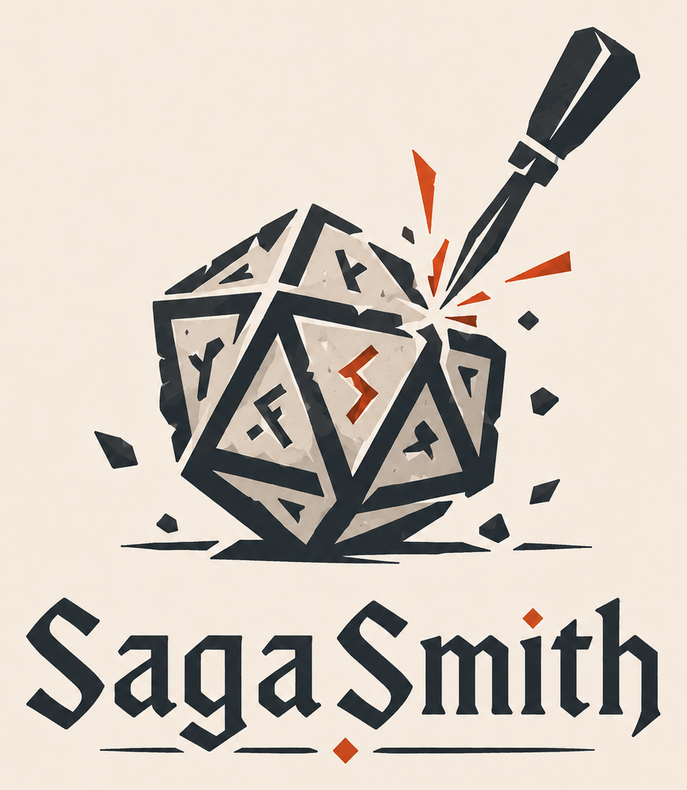

# SagaSmith Module Pack 创作 Skill

[English](README.md) | [中文](README-cn.md)

<p align="center">
  
</p>

SagaSmith Module Generator 是面向 D&D 5e 的 AI 原生创作 Skill，用于按当前
`sagasmith.content-package` v2 契约创作、审查并最终化可移植 Module Pack。

它不只是生成冒险散文，而是产出一份规范 Markdown 源稿、稳定运行时身份、结构化
Pack 决策、精确来源证据、可审计草稿历史，以及一个不可变 Pack artifact。

## 当前生命周期

```text
创作 brief 与 authoring ledger
→ 规范 Module Markdown + runtime manifest v1
→ module_draft(start)：机械首轮
→ module_draft(evidence/edit)：Agent 审查与修复
→ module_draft(finalize)：不可变 Module Pack v2
→ content_pack(get)：最终复核与交付
```

安装和激活与构建严格分离：

```text
content_pack(import) → 安装为非激活 Module
content_pack(activate) → 显式挂载到目标战役
```

默认结果是最终化的可移植 artifact，而不是已经激活的战役模组。

## Skill 创作的内容

- one-shot、独立冒险、连续战役和沙盒；
- 稳定 entities、secrets、clues、plot nodes、foreshadowing 与 branches；
- 章节、场景、子节和编号房间的 Markdown 结构；
- 有来源证据的队伍人数、等级、升级方式与预生成角色适用性；
- items、encounters、hazards、handouts、mechanics catalogs；
- narrative dossiers、可达 endings、continuity 与精确依赖；
- 有证据约束的 statblock、asset 和 actor 审查决策。

Core、D&D 和 MCP 继续权威管理场景解析、来源 bundle、checksum、actor-card
验证、不可变归档、修订、权限、幂等和激活。

## 创作范式

Skill 保留 Five-Room Dungeon、Node-Based、Hexcrawl、Three-Act、Hero's
Journey、Kishōtenketsu、Heist、Mystery、Conspyramid、Faction Turn、Fish
Tank、Blorb 等 25 种可复用范式。范式只指导设计，不会擅自变成 Pack schema
值，也不再强制固定章节数。

大型作品可以在共享 ledger 冻结后并行创作章节或区域。主 Agent 始终持有唯一
runtime manifest，整合唯一规范源稿，并执行完整审查与最终化流程。

## 安装

```bash
npx skills add SagaSmithAI/SagaSmith-module-gen-skills
```

以 `$sagasmith-modulegen` 调用。使用 SagaSmith D&D MCP 时，需要一个处于 Lobby
的创作战役和经过绑定的 DM/Owner 身份。

## 生态

| 仓库 | 职责 |
|---|---|
| **SagaSmith-module-gen-skills** | 模组设计与 Pack 创作流程 |
| [SagaSmith-dnd-mcp](https://github.com/SagaSmithAI/SagaSmith-dnd-mcp) | 草稿、证据、最终化、Pack 管理与运行时状态 |
| [sagasmith-dnd](https://github.com/SagaSmithAI/sagasmith-dnd) | 确定性 D&D 解析、schema 与机械 |
| [sagasmith-core](https://github.com/SagaSmithAI/sagasmith-core) | 系统无关 Package、来源、文档和持久化原语 |
| [SagaSmith-dnd-skills](https://github.com/SagaSmithAI/SagaSmith-dnd-skills) | D&D 带团与游玩流程 |
| [SagaSmith-agent](https://github.com/SagaSmithAI/SagaSmith-agent) | 多渠道 Agent 宿主 |

## 许可证

Apache-2.0
